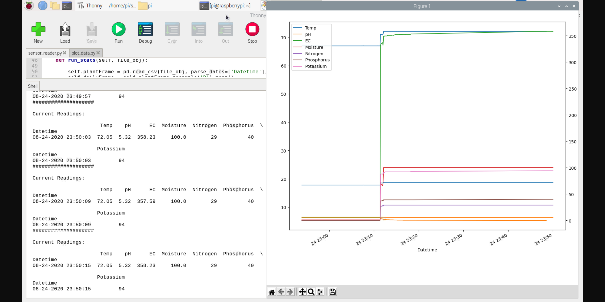
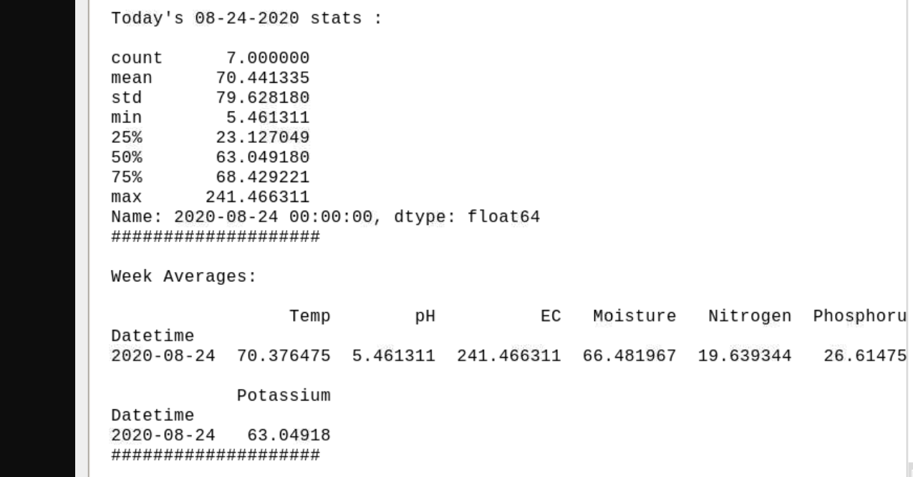

# pyFarm
Automate farming test sensors and nutrient dosing via IoT
* Rough Dev right now contributing as I go

# Raspberry Pi
The utility used to implement everything

## Remote Internet / Network
* https://docs.sixfab.com/docs/ppp-installer-for-base-hat
* https://tldp.org/HOWTO/PPP-HOWTO/
* https://docs.sixfab.com/docs/qmi-interface-with-cellular-iot-hat

# Motivation
After a lot of research, I wanted to build something that provided more clarity, transparency, and cost effective approach to growing. There are lots of tutorials and talks mentioning to have your NPK correct, but what is correct? How do you know when you have it correct? 

Then learning all the other variables that stem from Light and DLI, I knew there was room for improvement and opportunity.

# Shout-Outs
### Harley Smith

### Bruce Bugsbee

 
These scientists I learned an INCREDIBLE amount from and can't thank them enough for the free open-sourced information they shared in their decades of research. These guys are pioneers and rockstars in my book (and a lot of other ppl's book I'm sure). You can tell they are extremely passionate about their work.

# Examples
#### Poured a cup of tap water into the soil on the spike

#### Stats

